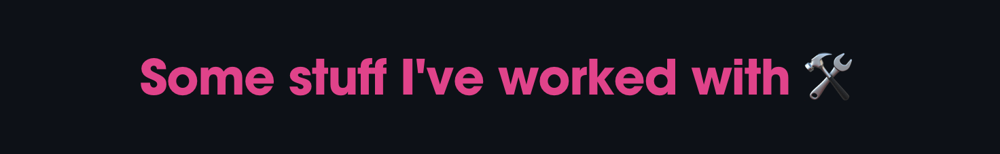

<!--  -->

---

#### 🙂 My name is Omar Basheer

#### 🎓 Computer Science Graduate | Ashesi University, Ghana

#### 🌱 Currently learning backend development (broad scope, I know, I'm in my exploring phase 🔭)

#### 🧘🏽‍♂️ Also working on myself. Code isn't the only thing I'm building...

---

<!-- &nbsp;&nbsp;&nbsp;&nbsp;&nbsp;&nbsp;&nbsp;&nbsp; -->

---

<!-- 
 -->

<!--  -->

<!--  -->

<!-- https://github-readme-streak-stats.herokuapp.com/demo/ -->
---

### Hold up...

The "top languages" card is showing the languages in my public repos, not neccessarily my skill level in them.

